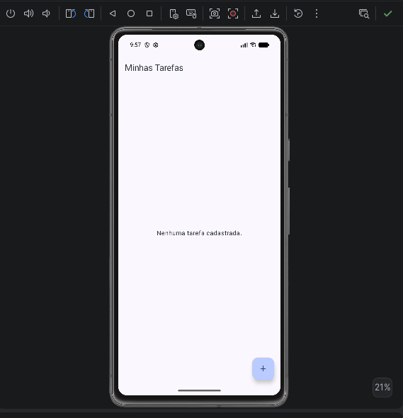
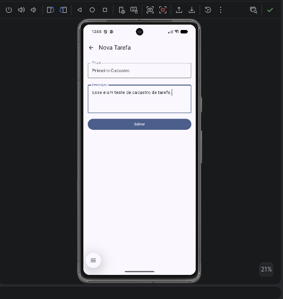
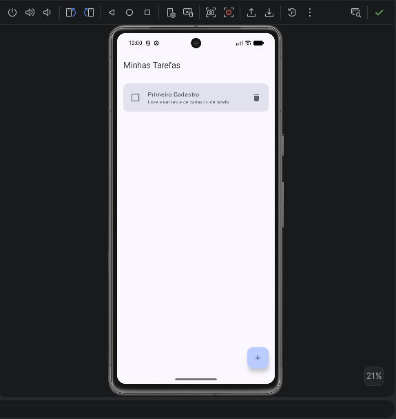
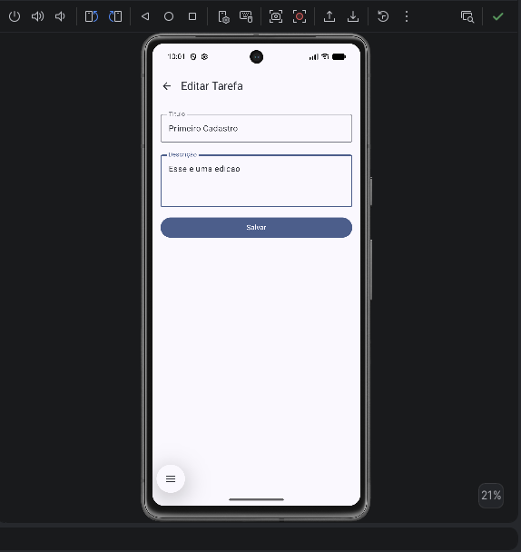
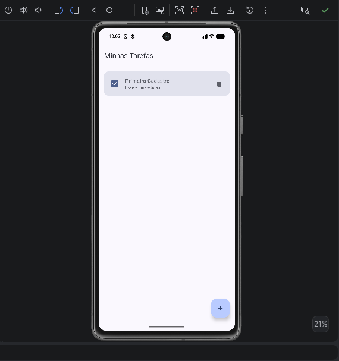
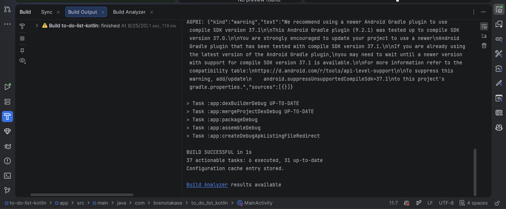

# To-Do List Kotlin

Aplicativo Android de lista de tarefas desenvolvido em Kotlin, com o objetivo de praticar arquitetura MVVM, persistência local com Room e construção de interfaces com Jetpack Compose. O usuário pode cadastrar, editar, concluir e excluir tarefas, navegando entre a lista e um formulário de cadastro/edição.

## Tecnologias utilizadas

- **Kotlin**
- **Jetpack Compose** — construção declarativa da interface
- **Room** — persistência local das tarefas em banco SQLite
- **Coroutines / Flow** — operações assíncronas e observação reativa dos dados
- **ViewModel** — retenção e exposição do estado da UI
- **Navigation Compose** — navegação entre as telas do app

## Arquitetura

O projeto segue o padrão **MVVM (Model-View-ViewModel)**, organizado nas seguintes camadas:

### `TarefaRepository`
Camada intermediária entre o `TarefaViewModel` e o `TarefaDao`. Expõe o `Flow<List<Tarefa>>` vindo do banco de dados e repassa as operações de inserir, atualizar e deletar, sem conter lógica de UI. É a única classe que conhece o `TarefaDao` diretamente.

### `TarefaViewModel`
Responsável por manter o estado da lista de tarefas para a UI. Converte o `Flow` do repositório em um `StateFlow` (via `stateIn`), garantindo que a interface sempre observe o dado mais atualizado mesmo após mudanças de configuração (como rotação de tela). Também expõe as funções `inserir`, `atualizar` e `deletar`, que disparam corrotinas em `viewModelScope` para não bloquear a thread principal. Uma `factory` interna cria o ViewModel já injetando o `TarefaRepository`, construído a partir do `TarefaDatabase`.

### `ListaTarefasScreen`
Observa `viewModel.tarefas` com `collectAsStateWithLifecycle()`, exibindo a lista em uma `LazyColumn`. Cada item mostra um `Checkbox` (para marcar como concluída), o título/descrição da tarefa e um botão de exclusão. Ao tocar em uma tarefa ou no botão de adicionar (FAB), a tela dispara os callbacks `onEditarTarefa` ou `onNovaTarefa`, que acionam a navegação — a própria tela não decide para onde navegar, apenas repassa a ação.

### `FormularioTarefaScreen`
Recebe um `tarefaId` vindo da navegação. Se o ID for `0`, o formulário trata como **cadastro de nova tarefa** (campos vazios); se for diferente de `0`, busca a tarefa correspondente na lista já observada do ViewModel e preenche os campos para **edição**. Ao salvar, chama `viewModel.inserir` ou `viewModel.atualizar` dependendo do caso, e volta para a tela anterior.

### `AppNavigation`
Configura o `NavHost` com duas rotas:
- `"lista"` — tela inicial, ponto de partida da navegação (`startDestination`)
- `"formulario/{tarefaId}"` — recebe o ID da tarefa como argumento na própria rota; `0` indica nova tarefa, qualquer outro valor indica edição

A navegação entre as telas é feita via `navController.navigate(...)`, e o retorno via `popBackStack()`.

### `MainActivity`
Ponto de entrada do app. Cria o `TarefaViewModel` usando `viewModel(factory = TarefaViewModel.factory(applicationContext))`, garantindo que o ViewModel tenha acesso ao banco de dados, e em seguida inicia o `AppNavigation` passando esse ViewModel — que é compartilhado entre todas as telas do app.

## Como executar o projeto

1. Clone o repositório:
   ```
   git clone https://github.com/BrenoTakase/to-do-list-kotlin.git
   ```
2. Abra a pasta no **Android Studio**.
3. Aguarde o Gradle sincronizar as dependências.
4. Selecione um emulador (ou dispositivo físico) e clique em **Run ▶**.

## Evidências

**Tela inicial com a lista de tarefas**



**Cadastro de uma nova tarefa**



**Tarefa cadastrada aparecendo na lista**



**Edição de uma tarefa existente**



**Tarefa marcada como concluída**



**Build do projeto sem erros**


